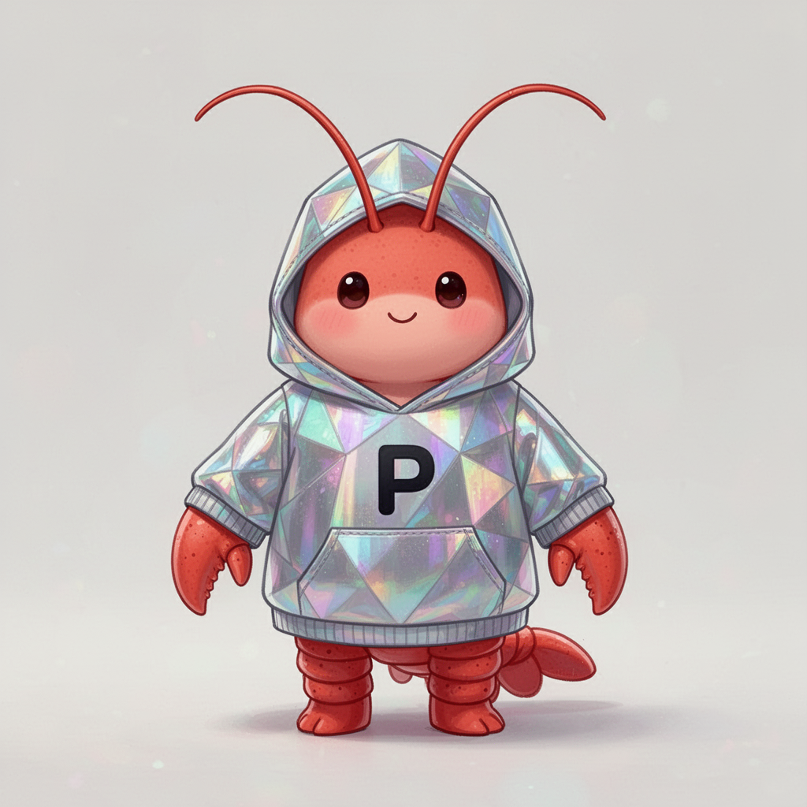
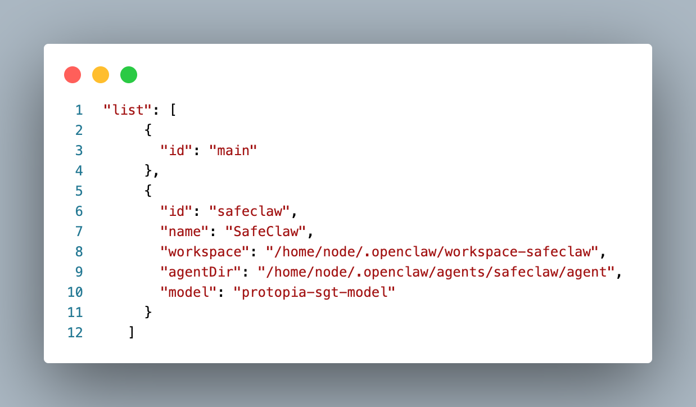
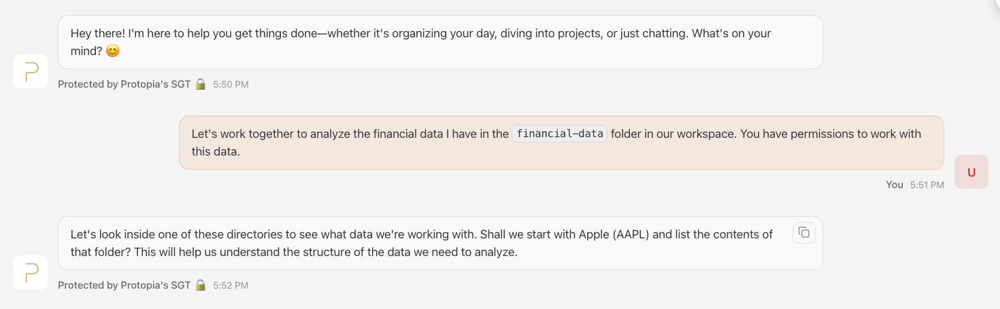
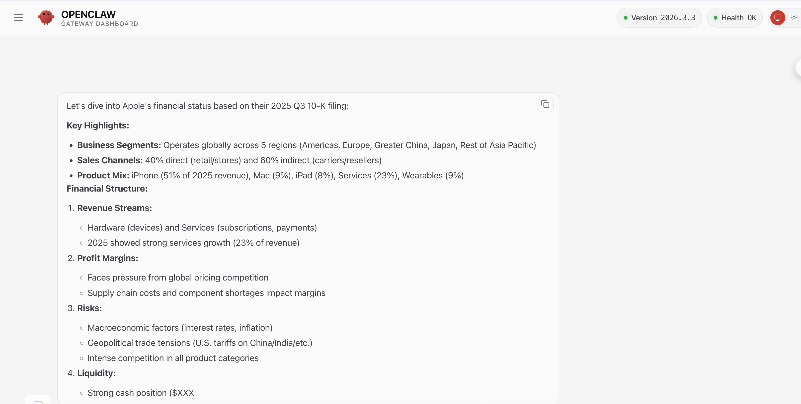
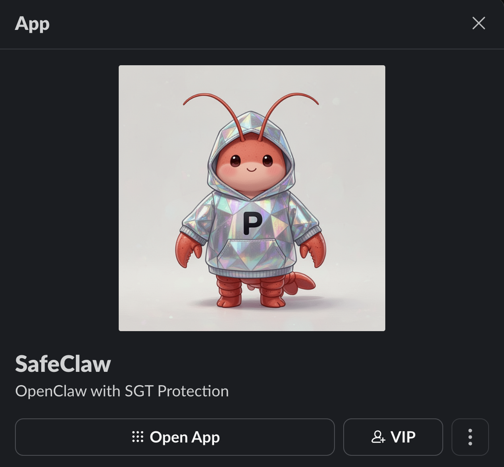
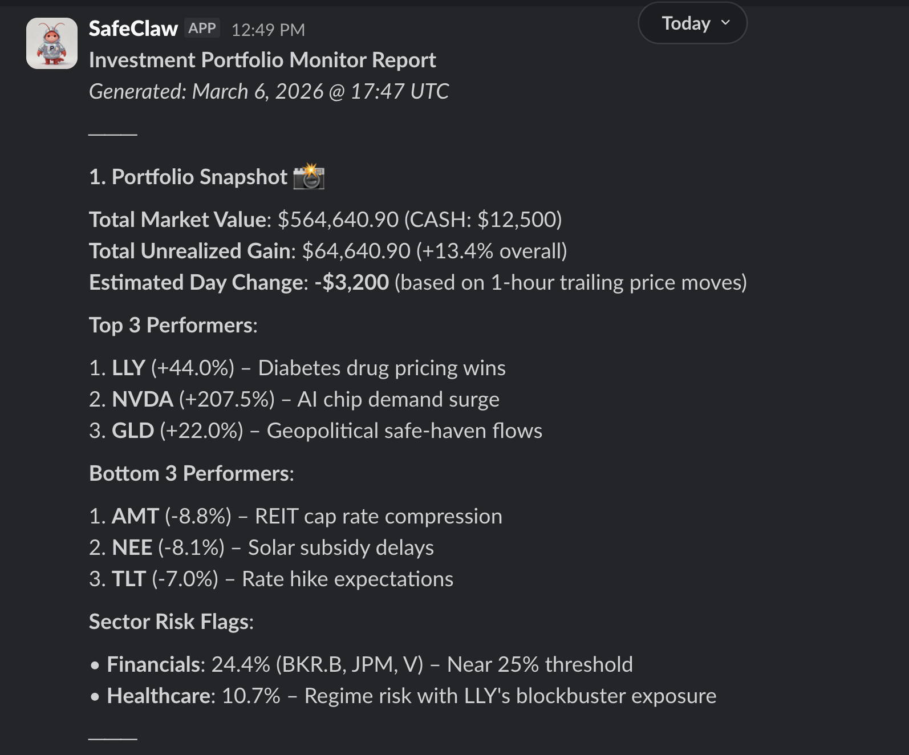
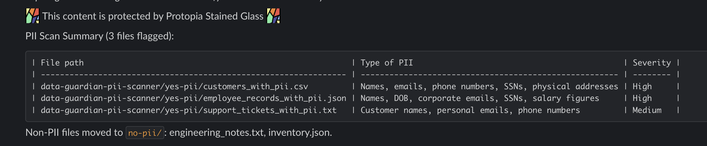
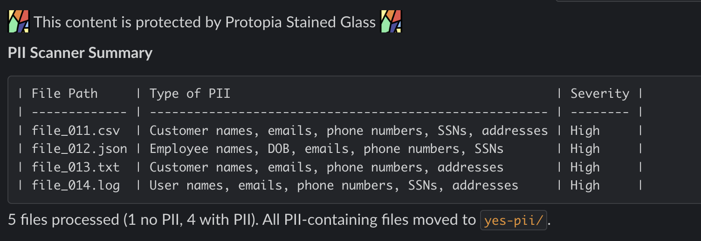

# SafeClaw: OpenClaw with Protopia SGT Protection 🦞



SafeClaw is an [OpenClaw](https://docs.openclaw.ai) agent with access to [Protopia SGT](https://protopia.ai/stained-glass-transform/) to expand the usability of sensitive data for AI with state-of-the-art data protection and privacy.

**SafeClaw** does not replace your existing OpenClaw agents, it provides an alternative for using your AI assistant with sensitive information. With SafeClaw, information never leaves your workspace as plaintext and cannot be recovered from the protected embeddings.

>💡 **Request access to Protopia SGT from https://protopia.ai/safeclaw/**

## Table of Contents

- [📋 Requirements](#requirements)
- [⚙️ Setup](#setup)
- [Setup OpenClaw Browsing Tool](#setup-openclaw-browsing-tool)
- [Example 1: (Financial Data 📈 Using the Chat Interface).](#example-1-financial-data--using-the-chat-interface)
- [Example 2 (Portfolio Monitoring Agent ⏱️ Using cron job).](#example-2-portfolio-monitoring-agent-️-using-cron-job)
- [Example 3 (✉️ Email scanning/report).](#example-3-email-scanningreport)
- [Example 4 (🔎 PII Scanner).](#example-4-pii-scanner)
- [Data Sources Integration](#data-sources-integration-)
    - [Google Gmail](#1-google-gmail-integration)

## Requirements

1. **Protopia Stained Glass Proxy (SGP) docker image (v1.49.2 or above).**
2. **SGT model (e.g `Protopia/SGT-for-Qwen3-32B-swept-water-bfloat16`)**.

> 💡 Request access to a Protopia SGT from https://protopia.ai/safeclaw/

3. Modal deployment script and Modal API keys (or any other way to host the upstream `Qwen3-32B` for inference.)
4. [docker-compose](deploy/compose/docker-compose.yaml) file.
5. [openclaw.json](openclaw.json) starter configuration.
6. [Demo Resources and Data](./examples/)
7. [Example Cron Tasks Scripts](./cron/)

## Setup

1. 🐳 Build custom `OpenClaw` docker image:
    
    ```bash
    # Build demo image from custom Dockerfile
    docker build -t ghcr.io/openclaw/openclaw:protopia-demo .
    ```

2. Copy [`openclaw.json`](openclaw.json) to your local OpenClaw config directory:
    ```bash
    cp openclaw.json ~/.openclaw/openclaw.json
    ```
    The file uses `${VAR}` placeholders for all secrets. The container expands them at startup using env vars passed by docker-compose (see step 4).

    > ⚠️ **Important**: This will replace your existing `~/.openclaw/openclaw.json`. Back it up first if needed.

3. Deploy upstream LLM to Modal with the [Modal Deployment Script](./modal_deploy_script.py) (or any other inference service of your choice).

    ```bash
    # for a Modal deployment:
    uv pip install modal
    MODAL_LOG_LEVEL=DEBUG modal deploy scripts/modal_deploy_output_protection.py
    ```

    ⚠️ **Important**: The modal deploy script loads the `OUTPUT_PROTECTION_IMAGE` from AWS ECR. Update this as needed. [Other options here](https://modal.com/docs/reference/modal.Image).

    ⚠️ **Important**: The Modal deployment script loads the `Qwen/Qwen3-32B` model from Hugging Face. Ensure your Modal `huggingface-secret` is configured with a valid HF token. This token may differ from the HF token used for SGT model access.

    - Update the [docker-compose](./deploy/compose/docker-compose.yaml) `stainedglass` service with your modal API keys to ensure SGT proxy can communicate with upstream Modal.

    💡 Hint: Set env variable: `SGP_REQUEST_HEADERS_TO_ADD: "Modal-Key=[your-key],Modal-Secret=[your-secret]"` in the docker-compose `stainedglass` service.

4. Set your credentials and run with `docker compose`. The easiest way is a `.env` file in the project root:
    ```bash
    # .env
    HF_TOKEN=...            # HF token with access to the Qwen32B SGT model (provided by Protopia)
    MODAL_KEY=...           # Modal API key (for upstream inference)
    MODAL_SECRET=...        # Modal API secret
    SGT_API_KEY=...         # SGT proxy API key (provided by Protopia)
    SLACK_BOT_TOKEN=...     # xoxb-... (required for examples 2, 3, 4)
    SLACK_APP_TOKEN=...     # xapp-... (required for examples 2, 3, 4)
    BRAVE_API_KEY=...       # Required for example 2 (portfolio monitor web search)
    GOG_KEYRING_PASSWORD=safeclaw   # Use 'safeclaw' for the demo Gmail account
    ```
    Then start:
    ```bash
    docker compose -f deploy/compose/docker-compose.yaml up -d
    ```

5. 🏁 Verify running containers:
    ```bash 
    docker ps

    # > you should have at least these containers running:
    ghcr.io/openclaw/openclaw:protopia-demo
    stainedglass-proxy
    ```

6. Register the `SafeClaw` OpenClaw agent
    ```bash
    docker compose -f deploy/compose/docker-compose.yaml exec openclaw-gateway openclaw agents add safeclaw
    ```
    - This will update your `~/.openclaw/openclaw.json` with your new `SafeClaw` agent.

    

7. Access OpenClaw Chat UI at `localhost:18790/chat?token=[your token]` (setup port-forward if needed).

    💡 Hint: You can find the `token` at `~/.openclaw/openclaw.json` under `auth`.

8. ⚠️ If you get a `pairing required` error, then you need to allow your device in Openclaw, follow these steps:

    ```bash
    # List pending requests
    docker compose -f deploy/compose/docker-compose.yaml exec openclaw-gateway openclaw devices list
    ```
    - Find devices listed under `Pending` and copy its request id.
    ```bash
    # Approve by request ID
    docker compose -f deploy/compose/docker-compose.yaml exec openclaw-gateway openclaw devices approve [request-id]
    ```

    - Test accessing the OpenClaw Web UI again, or connect to the OpenClaw `TUI`:
    ```bash
    docker compose -f deploy/compose/docker-compose.yaml exec openclaw-gateway openclaw tui
    ```

## Setup OpenClaw Browsing Tool

1. You will need a Brave API key. Get one from https://api-dashboard.search.brave.com
2. Run: `docker compose -f deploy/compose/docker-compose.yaml exec openclaw-gateway openclaw configure --section web` and follow the instructions.
3. Ask OpenClaw to perform a search for you!

---

# Example 1: (Financial Data 📈 Using the Chat Interface).
User uses the OpenClaw chat interface to work on financial data analysis.

1. The demo data is automatically seeded to `~/.openclaw/workspace-safeclaw/financial-data/` when the container first starts.




---

# Example 2 (Portfolio Monitoring Agent ⏱️ Using cron job).
OpenClaw agent scheduled task to generate a report based on local portfolio data and web search. The resulting report is posted on Slack.

## 1. Demo data: 
1. The demo data and task instructions are automatically seeded to `~/.openclaw/workspace-safeclaw/investment-portfolio/` when the container first starts.

## 2. Setup Slack Integration



1. Follow the steps here: (https://docs.openclaw.ai/channels/slack)

### Example Slack bot manifest for the `SafeClaw` bot.

```json
{
    "display_information": {
        "name": "SafeClaw",
        "description": "OpenClaw with SGT Protection",
        "background_color": "#737373"
    },
    "features": {
        "app_home": {
            "home_tab_enabled": false,
            "messages_tab_enabled": true,
            "messages_tab_read_only_enabled": false
        },
        "bot_user": {
            "display_name": "SafeClaw",
            "always_online": false
        },
        "slash_commands": [
            {
                "command": "/safeclaw",
                "description": "Send a message to OpenClaw",
                "should_escape": false
            }
        ]
    },
    "oauth_config": {
        "scopes": {
            "bot": [
                "chat:write",
                "channels:history",
                "channels:read",
                "groups:history",
                "im:history",
                "im:read",
                "im:write",
                "mpim:history",
                "mpim:read",
                "mpim:write",
                "users:read",
                "app_mentions:read",
                "assistant:write",
                "reactions:read",
                "reactions:write",
                "pins:read",
                "pins:write",
                "emoji:read",
                "commands",
                "files:read",
                "files:write"
            ]
        }
    },
    "settings": {
        "event_subscriptions": {
            "bot_events": [
                "app_mention",
                "message.channels",
                "message.groups",
                "message.im",
                "message.mpim",
                "reaction_added",
                "reaction_removed",
                "member_joined_channel",
                "member_left_channel",
                "channel_rename",
                "pin_added",
                "pin_removed"
            ]
        },
        "interactivity": {
            "is_enabled": true
        },
        "org_deploy_enabled": false,
        "socket_mode_enabled": true,
        "token_rotation_enabled": false
    }
}
```

```bash
# Test Slack integration
docker compose -f deploy/compose/docker-compose.yaml exec openclaw-gateway openclaw channels status --probe
```

## 3. Monitoring Job Setup

- Register the `portfolio_monitor` OpenClaw cron task:
```bash
# Register job.
docker compose -f deploy/compose/docker-compose.yaml exec -T openclaw-gateway sh < cron/portfolio_monitor.sh
# Verify job.
docker compose -f deploy/compose/docker-compose.yaml exec openclaw-gateway openclaw cron list
# Test run job.
docker compose -f deploy/compose/docker-compose.yaml exec openclaw-gateway openclaw cron run [job-id]
```

### Example Slack Message




---

# Example 3 (Email scanning/report).
Sends a report to Slack each day with a list of action items based on new emails.

1. Follow the steps to [setup OpenClaw Gmail Integration](#1-google-gmail-integration).
2. Follow the steps to [setup Slack Integration](#2-setup-slack-integration).
3. The demo data and task instructions are automatically seeded to `~/.openclaw/workspace-safeclaw/email-monitor/` when the container first starts.
4. Register the [`email_monitor`](./cron/email_monitor.sh) OpenClaw cron task:
    > 💡 Update ./cron/email_monitor.sh with your SLACK-CHANNEL-ID.
    
    ```bash
    # Register job.
    docker compose -f deploy/compose/docker-compose.yaml exec -T openclaw-gateway sh < cron/email_monitor.sh

    # Verify job.
    docker compose -f deploy/compose/docker-compose.yaml exec openclaw-gateway openclaw cron list

    # Test run job.
    docker compose -f deploy/compose/docker-compose.yaml exec openclaw-gateway openclaw cron run [job-id]
    ```

# Example 4 (PII Scanner)
Sorts and sends a report to slack when files are uploaded to a local directory, stating whether the files contained PII.

1. Follow the steps to [setup Slack Integration](#2-setup-slack-integration).
2. The demo data, task instructions, and sort directories (`pending/`, `no-pii/`, `yes-pii/`) are automatically seeded to `~/.openclaw/workspace-safeclaw/pii-scanner/` when the container first starts.
3. Register the [`pii_scanner`](./cron/pii_scanner.sh) OpenClaw cron task:
    > 💡 Update ./cron/pii_scanner.sh with your SLACK-CHANNEL-ID.
    ```bash
    # Register job.
    docker compose -f deploy/compose/docker-compose.yaml exec -T openclaw-gateway sh < cron/pii_scanner.sh

    # Verify job.
    docker compose -f deploy/compose/docker-compose.yaml exec openclaw-gateway openclaw cron list

    # Test run job.
    docker compose -f deploy/compose/docker-compose.yaml exec openclaw-gateway openclaw cron run [job-id]
    ```

### Example Slack PII Scan Report




# Data Sources Integration 📀

### 1. Google Gmail Integration

> 💡 OpenClaw gateway can expose a small HTTP webhook endpoint for external triggers.

> ⚠️ We strongly recommend the use a dedicated demo Gmail account, not a personal or work account. ⚠️

- The [OpenClaw Dockerfile](./Dockerfile) provided includes all the dependencies needed to run with the Gmail integration:
    - `gogcli`
    - `google-cloud-sdk`

#### Setup (once)
- [Setup and login to `gcloud`](https://docs.cloud.google.com/sdk/docs/install-sdk). Follow instructions to create a new project and setup Billing. **You need a Google Cloud account to create the OAuth client credentials**.
- You need an OAuth client secret JSON. Here's how to get it:

    - Go to Google Cloud Console → APIs & Services → Credentials
    - Click Create Credentials → OAuth Client ID
    - Set application type to Desktop app (required for gcloud auth flows)
    - Click Create, then Download JSON

```bash
# copy client credentials to OpenClaw workspace
mkdir -p ~/.openclaw/workspace-safeclaw/google && cp [your-secret.json] ~/.openclaw/workspace-safeclaw/google/client_secret.json
```

⚠️ If the Google Cloud app is in `Testing` publishing status, you will need to add your demo Gmail account as a Test user: `Google Auth Platform > Audience > Test Users`.

```bash
# 1. Auth client
docker compose -f deploy/compose/docker-compose.yaml exec openclaw-gateway gog auth credentials /home/node/.openclaw/workspace/google/client_secret.json

# 2. Add account 💡 Use 'safeclaw' when prompted for a keyring password since this is the valude set in the docker-compose for GOG_KEYRING_PASSWORD.
docker compose -f deploy/compose/docker-compose.yaml exec openclaw-gateway gog auth add --manual [demo-email@gmai.com] --services gmail # other services include calendar,drive,contacts,docs,sheets

# 3. Verify
docker compose -f deploy/compose/docker-compose.yaml exec openclaw-gateway gog auth list

# 4. Test
docker compose -f deploy/compose/docker-compose.yaml exec openclaw-gateway gog gmail messages search "in:inbox" --max 10
```

[🔙 back to email demo setup](#example-3-email-scanningreport)
